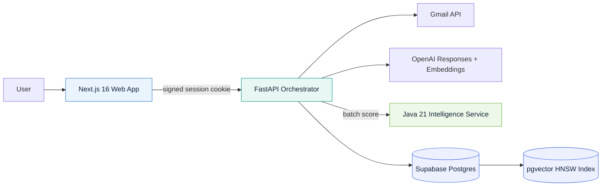
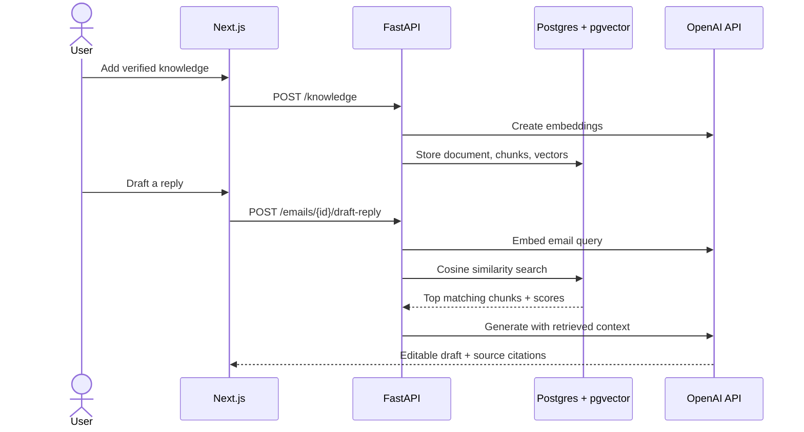

<div align="center">

# ✈️ MailPilot AI

### An intelligent Gmail command center built as a production-minded polyglot system

[](https://github.com/jeshwanthanthony/gmail-ai-platform/actions/workflows/ci.yml)
[](LICENSE)


**Gmail triage · explainable priority scoring · retrieval-augmented replies · safe OAuth · instant demo**

</div>


MailPilot AI turns a crowded inbox into a focused workspace. It reads Gmail through OAuth, ranks messages with an explainable Java scoring service, retrieves account-specific context from a pgvector knowledge base, and drafts grounded replies through the OpenAI Responses API.

The interface automatically opens with a realistic demo mailbox when credentials are absent, so reviewers can evaluate the product in under a minute.

## Why this project stands out

This is more than an AI wrapper. Each technology has a clear responsibility and a tested contract.

| Engineering signal | Implementation |
| --- | --- |
| Full-stack product work | Responsive Next.js 16 + React 19 inbox, live and demo modes, typed API client |
| Applied AI / RAG | Chunking, OpenAI embeddings, cosine retrieval, grounded prompts, visible source attribution |
| Database design | Supabase Postgres, additive SQL migrations, pgvector HNSW index, foreign keys, RLS |
| Polyglot architecture | TypeScript UI, Python orchestration, Java 21 scoring service, SQL data layer |
| API engineering | FastAPI/OpenAPI contracts, Pydantic validation, batch service calls, graceful degradation |
| Security thinking | OAuth state validation, encrypted tokens, signed sessions, sanitization, prompt-injection boundary |
| Delivery discipline | Multi-job GitHub Actions, Docker images, Dependabot, tests, linting, type checks, coverage gate |

## System architecture



### Grounded reply pipeline



The Java service is deliberately deterministic: urgency scoring is business logic that should be fast, explainable, and testable without an LLM. The Python service uses models only where semantic understanding adds value. See the deeper [architecture notes](docs/architecture.md).

## Features

- Real Gmail search, pagination, read state, archive, threaded replies, and reply-safe headers
- Knowledge workspace for indexing policies, product facts, or team guidance
- Per-account semantic retrieval using 1,536-dimensional `text-embedding-3-small` vectors
- Context-aware editable drafts with tone controls and retrieved-source badges
- Explainable priority labels from a batch-oriented Spring Boot service
- Safe HTML email rendering with an allowlist sanitizer and sandboxed iframe
- Fail-open integration behavior: inbox access still works if scoring or retrieval is temporarily unavailable
- Health endpoints, actuator metrics, typed validation, and generated FastAPI docs
- Credential-free portfolio demo with responsive desktop and mobile navigation

## Technology map

| Layer | Stack | Responsibility |
| --- | --- | --- |
| Web | TypeScript, Next.js 16, React 19, Tailwind CSS | Product UI, optimistic interactions, typed client |
| Orchestration API | Python 3.12, FastAPI, Pydantic | OAuth, Gmail, RAG, policy enforcement, service composition |
| Intelligence service | Java 21, Spring Boot 4.1, virtual threads | Batch priority scoring and explainable signals |
| AI | OpenAI Responses API + Embeddings API | Natural-language drafting and semantic representation |
| Data | Supabase Postgres, pgvector, SQL | Encrypted connections, documents, chunks, vector search |
| Platform | Docker Compose, GitHub Actions, Dependabot | Local parity, build verification, dependency maintenance |

## Run it

### Fastest path: product demo

```bash
npm --prefix frontend install
npm --prefix frontend run dev
```

Open [http://localhost:3000](http://localhost:3000). With no public API URL configured, MailPilot AI uses bundled demo data; no Gmail, database, or OpenAI credentials are needed.

### Run all three services

```bash
cp backend/.env.example backend/.env
docker compose up --build
```

| Service | Local URL |
| --- | --- |
| Web app | `http://localhost:3000` |
| FastAPI / Swagger UI | `http://localhost:8000/docs` |
| Intelligence health | `http://localhost:8080/actuator/health` |

The full stack still begins in demo mode until a Gmail account is connected.

### Enable live Gmail + RAG

1. Create a Supabase project and apply both files in [`supabase/migrations`](supabase/migrations).
2. Create a Google OAuth web client. Add `http://127.0.0.1:8000/auth/google/callback` as an authorized redirect URI.
3. Fill in `backend/.env` from the documented template.
4. Set `NEXT_PUBLIC_API_URL=http://localhost:8000` in `frontend/.env.local` when running outside Docker.

Generate the required token-encryption key:

```bash
python -c "from cryptography.fernet import Fernet; print(Fernet.generate_key().decode())"
```

The vector schema uses OpenAI's [`text-embedding-3-small`](https://developers.openai.com/api/docs/models/text-embedding-3-small) model and its default 1,536 dimensions. If the embedding model or dimensions change, add a new migration instead of editing applied schema history.

## API surface

| Method | Route | Purpose |
| --- | --- | --- |
| `GET` | `/health` | Service and integration readiness |
| `GET` | `/auth/status` | Current connection state |
| `GET` | `/auth/google/start` | Start Google OAuth |
| `GET` | `/emails` | Search, paginate, and priority-score inbox messages |
| `GET` | `/emails/{id}/body` | Fetch a sanitized message body |
| `PATCH` | `/emails/{id}` | Change read state or archive |
| `POST` | `/emails/{id}/draft-reply` | RAG-grounded editable reply |
| `POST` | `/emails/{id}/send` | Send in the original Gmail thread |
| `GET` | `/knowledge` | List account knowledge documents |
| `POST` | `/knowledge` | Chunk, embed, and index a document |
| `POST` | `/knowledge/search` | Inspect semantic retrieval results |
| `DELETE` | `/knowledge/{id}` | Remove a document and its chunks |
| `POST` | `:8080/api/v1/triage/score-batch` | Score up to 50 messages in one Java call |

## Quality gates

```bash
make lint   # Ruff + ESLint + TypeScript
make test   # Pytest + Maven/JUnit + JaCoCo threshold
make build  # Next.js production build + executable Spring Boot JAR
```

GitHub Actions runs backend, frontend, Java, and container jobs independently. The suite covers OAuth guards, Gmail parsing and sanitization, token encryption, vector chunking and ingestion, scoring fallbacks, scoring rules, input validation, and HTTP contracts.

## Security model

- The browser never receives Gmail, OpenAI, Supabase service, or encryption credentials.
- OAuth state is validated before code exchange; sessions are signed and production cookies are secure.
- Access and refresh tokens are encrypted with Fernet before database storage.
- Knowledge records and vector matches are explicitly scoped to the internal user ID.
- Scripts, forms, tracking images, and unsafe email markup are removed before rendering.
- Email and retrieved text are marked as untrusted prompt data; model requests use `store=False`.
- Reply sending remains a separate, user-confirmed action after generation and editing.

See [SECURITY.md](SECURITY.md) for vulnerability reporting and data-handling expectations.

## Repository guide

```text
gmail-ai-platform/
├── frontend/                 # Next.js + TypeScript product UI
├── backend/                  # FastAPI orchestration, Gmail, OpenAI, RAG
├── intelligence-service/     # Java 21 / Spring Boot scoring microservice
├── supabase/migrations/      # Postgres + pgvector schema history
├── docs/                     # Screenshot and architecture decisions
├── .github/workflows/        # Polyglot CI pipeline
└── docker-compose.yml        # Local service topology
```

## Engineering roadmap

- [x] Secure Gmail OAuth and mailbox operations
- [x] Responsive demo-first product experience
- [x] pgvector knowledge base and citation-aware RAG
- [x] Explainable Java priority microservice
- [x] Polyglot CI, containers, coverage enforcement, and dependency automation
- [ ] Background Gmail sync with a durable queue
- [ ] Retrieval and drafting eval dataset with regression scoring
- [ ] OpenTelemetry traces across Python → Java → external APIs

## License

[MIT](LICENSE) — built as an internship project and evolved into a production-style engineering portfolio.
