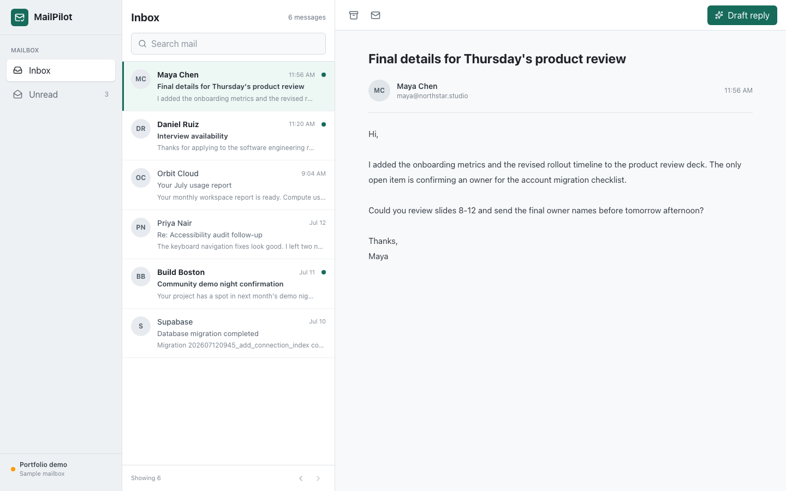
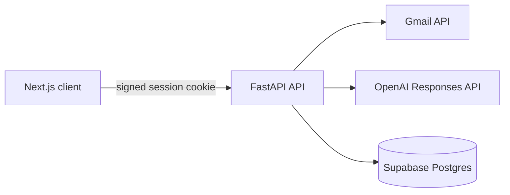

# MailPilot

MailPilot is a full-stack Gmail workspace for triaging messages and preparing context-aware replies. It combines a responsive Next.js inbox with a FastAPI service that handles Google OAuth, Gmail operations, and assisted drafting.

The web app opens with a complete demo mailbox when credentials are not configured, so the core workflow can be reviewed immediately.



## Highlights

- Google OAuth 2.0 with server-side state validation and signed sessions
- Gmail search, pagination, read status, archive, threaded replies, and safe email rendering
- Editable reply drafts with tone and instruction controls
- OpenAI Responses API integration with stateless requests
- Per-account token storage in Supabase with row-level security enabled
- Responsive three-pane interface with mobile message navigation
- Typed request and response models across the frontend and backend
- Pytest coverage, Ruff, ESLint, TypeScript checks, Docker, and GitHub Actions

## Architecture



The browser never receives Gmail or OpenAI credentials. OAuth tokens are encrypted before they are stored through the backend, while the browser session contains only the internal user identifier.

## Stack

| Area | Technology |
| --- | --- |
| Frontend | Next.js 16, React 19, TypeScript, Tailwind CSS, Lucide |
| Backend | FastAPI, Pydantic, Google API client, OpenAI Python SDK |
| Data | Supabase Postgres |
| Quality | Pytest, Ruff, ESLint, TypeScript, GitHub Actions |
| Runtime | Docker Compose, Node.js 22, Python 3.12 |

## Local Setup

### Demo mode

```bash
cd frontend
npm install
npm run dev
```

Open `http://localhost:3000`. With no `NEXT_PUBLIC_API_URL`, MailPilot uses the bundled demo mailbox.

### Connected mode

1. Create a Supabase project and run [`supabase/migrations/202607130001_initial_schema.sql`](supabase/migrations/202607130001_initial_schema.sql).
2. Create a Google OAuth web client with `http://127.0.0.1:8000/auth/google/callback` as an authorized redirect URI.
3. Copy the environment templates and add credentials.

```bash
cp backend/.env.example backend/.env
cp frontend/.env.example frontend/.env.local
python3 -m venv backend/venv
source backend/venv/bin/activate
pip install -r backend/requirements-dev.txt
npm --prefix frontend install
```

Generate `TOKEN_ENCRYPTION_KEY` with:

```bash
python -c "from cryptography.fernet import Fernet; print(Fernet.generate_key().decode())"
```

4. Start both applications in separate terminals.

```bash
make dev-api
make dev-web
```

FastAPI documentation is available at `http://127.0.0.1:8000/docs`.

## Validation

```bash
make lint
make test
make build
```

The same checks run for every pull request in GitHub Actions.

## API Surface

| Method | Route | Purpose |
| --- | --- | --- |
| `GET` | `/auth/status` | Return the current connection state |
| `GET` | `/auth/google/start` | Begin Google OAuth |
| `GET` | `/emails` | Search and paginate inbox messages |
| `GET` | `/emails/{id}/body` | Return a sanitized message body |
| `PATCH` | `/emails/{id}` | Change read state or archive a message |
| `POST` | `/emails/{id}/draft-reply` | Generate an editable reply |
| `POST` | `/emails/{id}/send` | Send a reply in the original Gmail thread |

## Security Notes

- OAuth state is checked before exchanging authorization codes.
- Production cookies are marked secure and use `SameSite=Lax`.
- Gmail tokens are encrypted at the application layer before database storage.
- Email HTML is allowlist-sanitized and rendered in a sandboxed iframe.
- Tracking images, scripts, forms, and embedded content are stripped.
- Model requests use `store=False`; only the selected email is sent for drafting.
- Supabase keys and provider credentials remain backend-only environment variables.

## License

MIT
